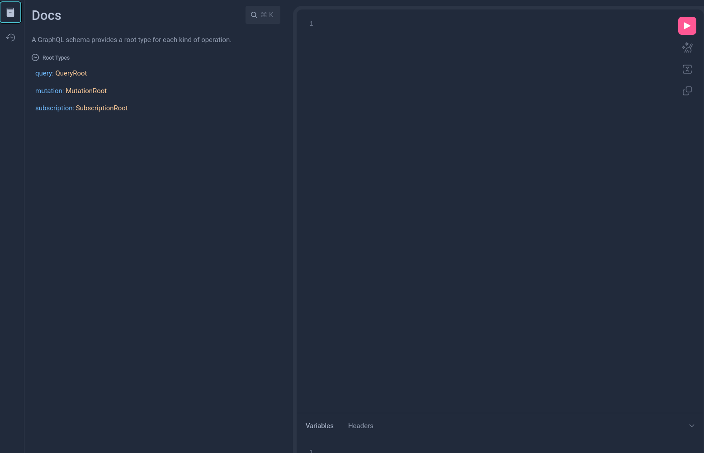

# 节点服务

截至目前，我们已了解如何将Linera客户端作为终端二进制文件使用。不过，该客户端还具备节点功能：

1. 执行区块
2. 提供GraphQL API与IDE​​，支持与应用程序及系统进行动态交互
3. 监听验证节点通知​​，并自动更新本地链状态

若需与节点服务交互，请以`服务`模式运行`linera`：

```bash
linera service
```

默认情况下，节点服务将在8080端口运行（可通过--port参数覆盖此设置）。

## ​关于GraphQL的说明​​

Linera采用GraphQL作为查询语言，用于与系统各部分进行交互。GraphQL使客户端能够构建查询，从而精准获取所需数据，避免冗余信息。

GraphQL在应用开发中被广泛使用，例如从前端查询应用状态。

如需深入了解GraphQL，请查阅[官方文档](https://graphql.org/learn/)。

## GraphiQL IDE

便捷的GraphQL IDE集成​​，节点服务内置了名为GraphiQL的GraphQL集成开发环境。要使用GraphiQL，请启动节点服务并访问 `localhost:8080/`。

通过GraphiQL IDE左侧的模式浏览器，可动态探索系统及应用程序的实时状态。



## GraphQL系统API

节点服务还提供了一个与系统操作集对应的GraphQL API。点击`MutationRoot`即可查看全部系统操作。

## GraphQL application API

要与应用程序交互，需以服务模式运行Linera客户端。该客户端会为所有运行在所属链上的应用程序暴露GraphQL API，接口地址为：`localhost:8080/chains/<chain-id>/applications/<application-id>`。

通过浏览器访问该地址将打开GraphiQL界面，从而可以图形化探索应用程序状态。