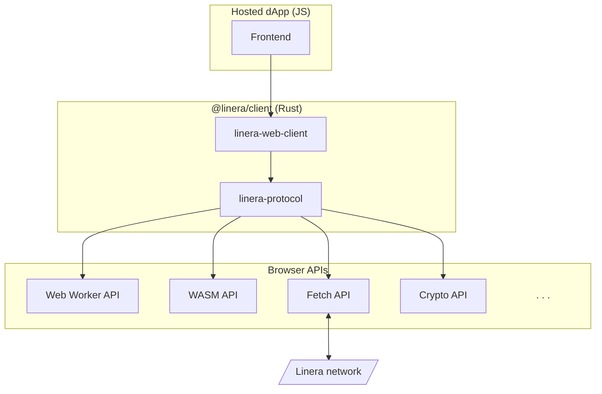

# ​前端架构概览​​

Linera客户端库基于Rust实现，通过编译为WebAssembly并借助[`wasm-bindgen`](https://github.com/rustwasm/wasm-bindgen)生成JavaScript适配层，实现自动下载Wasm模块、转发调用请求及Rust与JS间的类型封送机制。

此外，在Web环境中部分系统API以JavaScript API形式由浏览器直接提供，因此针对这些API的系统调用将被替换为对等浏览器API的外部函数接口（FFI）调用。特别地：

- 获取当前日期时间时，我们通过调用 JavaScript [`Date::now`](https://developer.mozilla.org/en-US/docs/Web/JavaScript/Reference/Global_Objects/Date/now) API 实现。
- 我们采用 [Web Crypto API](https://www.w3.org/TR/WebCryptoAPI/#Crypto-method-getRandomValues) 作为加密随机性来源。
- 在浏览器事件循环中，[Tokio](https://tokio.rs/)异步运行时由JavaScript Promise机制替代。
- 浏览器环境中，与验证节点的gRPC通信被替换为基于浏览器[`fetch` API](https://developer.mozilla.org/en-US/docs/Web/API/Fetch_API/Using_Fetch)的[gRPC-Web](https://grpc.io/docs/platforms/web/basics/)实现。
- 文件系统访问由 [IndexedDB](https://developer.mozilla.org/en-US/docs/Web/API/IndexedDB_API) 替代实现。
- 客户端采用单线程运行模式，但字节码执行部分通过 [Web Workers](https://developer.mozilla.org/en-US/docs/Web/API/Web_Workers_API) 实现多线程处理。

内嵌客户端库的dApp前端架构可归纳如下：

