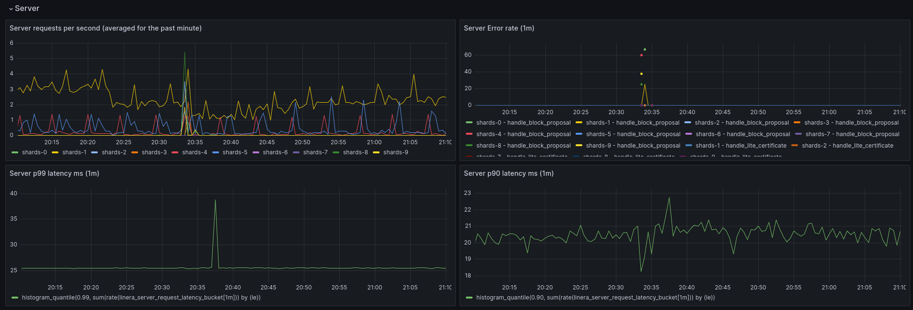

# 监控与日志

本节介绍如何在验证节点部署后监控其运行状态和性能。

## 监控

验证节点自带 [Prometheus](https://prometheus.io/) 实例用于指标监控，并集成 [Grafana](https://grafana.com/) 实现可观测性。

Grafana 默认包含名为“General”的仪表盘，用于展示验证节点运行时的常见指标，涵盖从延迟到错误率等关键参数。



相关端口信息可在 [Docker Compose 清单](https://github.com/linera-io/linera-protocol/blob/main/docker/docker-compose.yml)文件中查找。

## 日志

当前，日志功能由 Docker 隐式处理，它会捕获代理和分片进程的标准输出。

要查看指定容器的日志，请运行：

```bash
docker compose logs <service-name>
```
