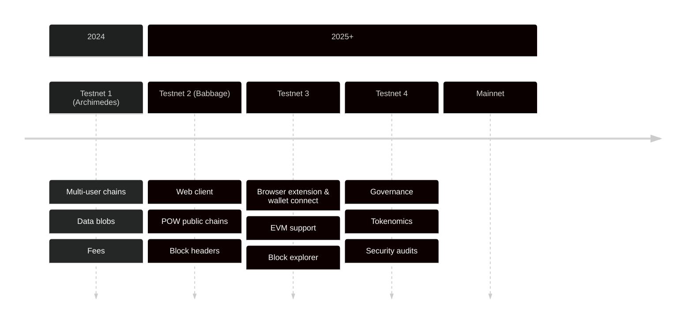

# 路线图

本节概述当前技术路线图。需特别说明：该规划仅作信息参考，可能随时调整。

## Testnet #1 (2024年11月发布)

代号：阿基米德

**SDK**

- 发布 Rust SDK v0.13+

- 首个浏览器端Linera客户端网络演示

- 用户数据Blob存储

**核心协议**

- 应用程序字节码与用户数据Blob存储

- 多用户链（例如用于链上游戏演示）

- 初始交易费用支持

**基础设施**

- 验证节点固定工作节点数

- 完成20+外部验证节点接入

## Testnet #2 (计划于2025年4月)

代号：巴贝奇

**SDK**

- 官方Web客户端框架

- 原生预言机支持：HTTP查询与非确定性计算

- 支持工作量证明公有链

- 用户与应用地址简化

**核心协议**

- 弹性动态重构

- 终止"请求-应用"操作

- 桥接友好型区块头（兼容EVM签名）

**基础设施**

- 优化热修复发布流程

- 支持工作节点离线弹性调整

## Testnet #3

**SDK**

- 浏览器扩展与钱包连接

- 事件流（弃用发布/订阅频道）

- EVM实验性支持

- EVM地址兼容性

**核心协议**

- 弹性扩展客户端支持分片链执行及区块同步优化

- 执行缓存加速服务器端及客户端区块执行

- 协议可升级性（含区块格式、虚拟机及系统API）

- 简化链创建及外部微链支持

**基础设施**

- 高TPS配置

- 区块索引与沃尔拉斯存档

## Testnet #4

**SDK**

- 稳定支持EVM

- 交易脚本

- 应用程序可升级性

**核心协议**

- 治理链

- 最终代币经济模型与费用

- 存储持久性

**基础设施**

- 网络性能测量与验证者激励

- 安全审计

## 主网及后续演进

**SDK**

- 账户抽象与费用主控

- Linera轻客户端支持其他合约语言（如Solidity、Sui Move）

**核心协议**

- 无需许可审计协议

- 性能优化

**基础设施**

- 动态分片分配与弹性支持

- 地理分片

- 多云服务商支持

- 原生桥接
